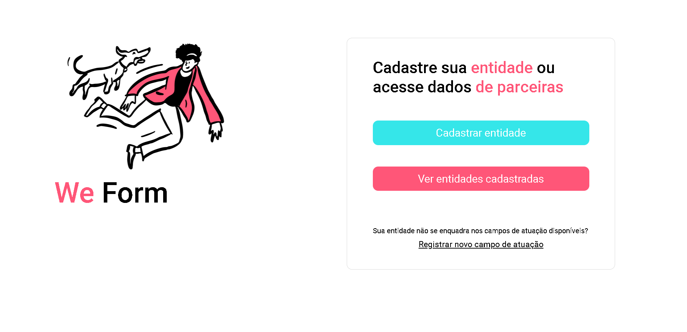

<h1 align="center">Cadastro de entidades</h1>

Projeto desenvolvido durante a Trilha Digital / Web Front-End, curso ministrado pela Ada Tech e promovido por meio do Santander Coders 2023. 

  <a href="#-tecnologias">Tecnologias</a>&nbsp;&nbsp;&nbsp;|&nbsp;&nbsp;&nbsp;
  <a href="#-projeto">Projeto</a>&nbsp;&nbsp;&nbsp;

 

  

## 🚀 Tecnologias

Esse projeto foi desenvolvido com as seguintes tecnologias:

- HTML e CSS
- JavaScript
- Git e Github

## 💻 Projeto

O projeto é destinado à prática do conteúdo ensinado no curso de formação Front-End Ada / Santander Coders 2023.

- [Visite o projeto online](https://brunanasser.github.io/entidades/)